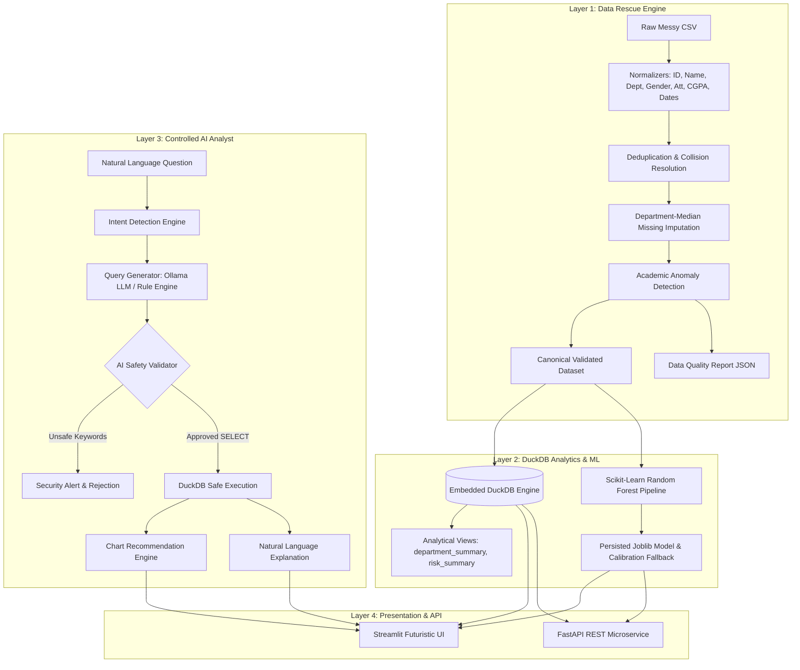

# StudentIQ — Student Retention & Welfare Intelligence

[](https://www.python.org/downloads/)
[](https://opensource.org/licenses/MIT)
[](https://duckdb.org/)
[](https://fastapi.tiangolo.com/)
[](https://streamlit.io/)
[](https://docs.pytest.org/)

> **TransOrg GraphIQ Datathon**  
> **Track:** Education & EdTech — Student Retention & Welfare Efficacy Tracker  
> **Core Narrative:** *"From messy student data to actionable retention and welfare insights."*

---

## 1. Executive Overview

Educational institutions struggle with fragmented, noisy student records that obscure impending dropout risks. Early indicators such as declining attendance or subtle academic slippage frequently go unnoticed until formal failure occurs.

**StudentIQ** is an end-to-end intelligence platform that transforms raw, messy institutional records into continuous ground truth, computes real-time analytical telemetry via DuckDB, evaluates retention risk via Scikit-Learn models, and empowers decision-makers with an AI Analyst copilot.

---

## 2. Why StudentIQ is Not CRUD

Traditional administrative management systems are simple Create-Read-Update-Delete (CRUD) applications. StudentIQ is fundamentally distinct:

| Dimension | Traditional CRUD System | StudentIQ Intelligence Platform |
|---|---|---|
| **Data Ingestion** | Assumes clean, structured, formatted input | **14-Step Data Rescue Engine** handles noisy IDs, slang, missing data, and anomalies |
| **Integrity Assurance** | Silent failure or database crashes on dirty data | **Data Quality Scoring (0-100)** with full audit provenance |
| **Analytics Engine** | Static SQL row queries in transactional databases | **Embedded DuckDB Columnar OLAP** computing real-time cross-cohort metrics |
| **Risk Assessment** | Static arbitrary rule or zero prediction | **Scikit-Learn ML Classifier** combined with continuous retention risk index |
| **User Interaction** | Form-based navigation and manual tables | **Controlled Natural Language AI Analyst** with AST-level safety and automatic chart selection |

---

## 3. System Architecture



---

## 4. Key Pillars

### Layer 1: Data Rescue Engine
The 14-step automated pipeline sanitizes heterogeneous records:
1. **Tolerant Ingestion**: UTF-8 and Latin-1 fallback parsing.
2. **Column Normalization**: Resolves aliases (`reg_no`, `branch`, `attendance_rate`).
3. **Exact Deduplication**: Drops duplicate row snapshots.
4. **Identifier Normalization**: Standardizes student keys to `STU-XXXX`.
5. **Name Casing**: Cleans symbols and standardizes to Title Case.
6. **Department Alias Resolution**: Standardizes variations (`cse`, `comp sci`, `mech`, `ece`) into 6 accredited disciplines.
7. **Gender Normalization**: Unifies categories to `Male`, `Female`, or `Other`.
8. **Attendance Normalization**: Converts percentages (`85%`), decimals (`0.85`), and scales 10x typos (`850 -> 85.0`).
9. **CGPA Bounds Enforcement**: Repairs commas (`7,85`), rejects impossible values (<0 or >10).
10. **ISO Date Normalization**: Standardizes dates to `YYYY-MM-DD`.
11. **Department-Median Imputation**: Intelligently fills missing numerical indicators using department medians.
12. **Academic Anomaly Detection**: Flags cognitive dissonance (e.g. 9.8 CGPA with 15% attendance).
13. **Derived Feature Generation**: Computes continuous academic risk score and support priority.
14. **Data Quality Scoring**: Computes composite data quality score out of 100.

### Layer 2: DuckDB Analytical Engine
- Zero-dependency, embedded columnar OLAP database.
- Blazing-fast aggregations across student cohorts without expensive external infrastructure.
- In-memory analytical views: `department_summary` and `risk_summary`.

### Layer 3: Machine Learning & Retention Risk
- **Supervised Model**: Scikit-Learn Random Forest Classifier trained on academic features.
- **Dataset Size Check**: If sample size is statistically insufficient, displays: *"Dataset too small for statistically reliable model evaluation"* and automatically calibrates to the rule-based engine.
- **Continuous Retention Risk Formula**:
  $$\text{Risk Score} = (10 - \text{CGPA}) \times 6 + (100 - \text{Attendance}) \times 0.4$$
- **Tiers**: `LOW`, `MEDIUM`, `HIGH`, `CRITICAL`.
- **Support Queue**: Prioritizes students requiring immediate advisory intervention.
- *Notice: Strictly framed as an academic retention indicator, not a medical or psychological diagnosis.*

### Layer 4: AI Analyst & Safety Protocol
- **Natural Language Copilot**: Translates questions into optimized SQL queries.
- **AI Safety Validator**: Enforces strict read-only analytical SELECT queries; immediately rejects `DROP`, `DELETE`, `UPDATE`, `INSERT`, `ALTER`, `TRUNCATE`, `PRAGMA`, and multi-statement injection attempts.
- **Dual Mode**: Seamlessly queries local Ollama if available; falls back automatically to the rule-based generator with zero degradation.
- **Automatic Chart Selection**: Categorical comparisons -> Bar; Relationships -> Scatter; Proportions -> Donut; Rankings -> Horizontal Bar.

### Layer 5: Premium Dark Futuristic Dashboard
- Obsidian dark theme with neon cyan (`#00E5FF`), electric violet (`#7C4DFF`), and emerald accents.
- Reusable glassmorphic cards and interactive Plotly charts.
- 5 comprehensive pages: Executive Dashboard, Data Quality Audit, Student Directory, Retention Risk Analysis, and Ask StudentIQ Copilot.

---

## 5. Project Directory Structure

```
Student-Retention-Welfare-Tracker-01/
├── README.md
├── LICENSE
├── requirements.txt
├── .env.example
├── .gitignore
├── app/
│   ├── __init__.py
│   ├── streamlit_app.py
│   ├── components/
│   │   ├── __init__.py
│   │   ├── sidebar.py
│   │   ├── kpi_cards.py
│   │   ├── charts.py
│   │   ├── tables.py
│   │   └── agent_chat.py
│   └── pages/
│       ├── __init__.py
│       ├── 01_Executive_Dashboard.py
│       ├── 02_Data_Quality.py
│       ├── 03_Student_Analytics.py
│       ├── 04_Risk_Analysis.py
│       └── 05_AI_Analyst.py
├── api/
│   ├── __init__.py
│   ├── main.py
│   └── routes/
│       ├── __init__.py
│       ├── students.py
│       ├── analytics.py
│       └── agent.py
├── data/
│   ├── raw/
│   │   └── messy_students.csv
│   ├── processed/
│   │   ├── cleaned_students.csv
│   │   └── analytics.duckdb
│   └── sample/
│       └── README.md
├── docs/
│   ├── architecture.md
│   ├── data_dictionary.md
│   ├── methodology.md
│   └── demo_questions.md
├── notebooks/
│   └── exploration.ipynb
├── scripts/
│   ├── generate_messy_data.py
│   ├── clean_data.py
│   ├── build_database.py
│   └── train_model.py
├── src/
│   ├── __init__.py
│   ├── config/
│   │   ├── __init__.py
│   │   └── settings.py
│   ├── data/
│   │   ├── __init__.py
│   │   ├── loader.py
│   │   ├── cleaner.py
│   │   ├── validator.py
│   │   ├── normalizer.py
│   │   └── quality_report.py
│   ├── analytics/
│   │   ├── __init__.py
│   │   ├── database.py
│   │   ├── queries.py
│   │   ├── metrics.py
│   │   └── insights.py
│   ├── ml/
│   │   ├── __init__.py
│   │   ├── train.py
│   │   ├── predict.py
│   │   ├── model.py
│   │   └── features.py
│   ├── agent/
│   │   ├── __init__.py
│   │   ├── agent.py
│   │   ├── intent.py
│   │   ├── query_generator.py
│   │   ├── query_validator.py
│   │   ├── chart_selector.py
│   │   └── prompts.py
│   └── utils/
│       ├── __init__.py
│       ├── logging.py
│       └── helpers.py
└── tests/
    ├── __init__.py
    ├── test_cleaner.py
    ├── test_validator.py
    ├── test_metrics.py
    ├── test_queries.py
    └── test_agent.py
```

---

## 6. Installation & Quickstart

### Prerequisites
- Python 3.11+
- Virtual environment (recommended)

### Step 1: Clone or Extract Repository
```bash
cd Student-Retention-Welfare-Tracker-01
```

### Step 2: Install Dependencies
```bash
pip install -r requirements.txt
```

### Step 3: Execute End-to-End Pipeline
Run the reproducible pipeline scripts in sequence:

```bash
# 1. Generate realistic messy dataset
python scripts/generate_messy_data.py

# 2. Execute 14-step Data Rescue cleaning pipeline
python scripts/clean_data.py

# 3. Ingest cleaned data into DuckDB analytical store
python scripts/build_database.py

# 4. Train and calibrate student retention risk ML model
python scripts/train_model.py
```

### Step 4: Run Test Suite
Verify that all unit and integration tests pass:
```bash
pytest -v
```

---

## 7. Running the Applications

### Launch Streamlit Dashboard
```bash
streamlit run app/streamlit_app.py
```
Open your browser at `http://localhost:8501`.

### Launch FastAPI Backend
```bash
uvicorn api.main:app --reload
```
Access interactive Swagger API documentation at `http://localhost:8000/docs`.

---

## 8. REST API Documentation

| Method | Endpoint | Description |
|---|---|---|
| `GET` | `/` | Health check and DuckDB status |
| `GET` | `/analytics/summary` | Top-level institutional KPIs and dynamic insights |
| `GET` | `/analytics/departments` | Aggregated metrics per academic department |
| `GET` | `/analytics/risk` | Retention risk breakdown distribution |
| `GET` | `/students` | Filterable and searchable student records |
| `GET` | `/students/{student_id}` | Detailed student profile with individual risk explanation |
| `POST` | `/agent/query` | Natural language query translation into safe SQL |

---

## 9. Curated Demo Questions for Jury

Test these queries in the **Ask StudentIQ** copilot interface:
1. `Show students with attendance below 60%.`
2. `Which departments have the lowest average CGPA?`
3. `Compare CSE, ECE and IT.`
4. `Show the relationship between attendance and CGPA.`
5. `Which students are at high risk?`
6. `Show the distribution of student risk.`
7. `Which department needs the most academic support?`
8. `Show top 10 students by CGPA.`

---

## 10. Technology Stack

- **Data Processing:** Pandas, NumPy
- **Analytical Store:** DuckDB OLAP
- **Machine Learning:** Scikit-Learn, Joblib
- **Visualization:** Plotly Express & Graph Objects
- **Frontend Dashboard:** Streamlit
- **Backend API:** FastAPI, Uvicorn, Pydantic
- **Testing:** Pytest
- **Optional Local LLM:** Ollama (Mistral / Llama 3)

---

## 11. Future Scope

- Integration with Learning Management Systems (Canvas, Moodle) via LTI standards.
- Longitudinal cohort progression tracking across 8 semesters.
- Automated welfare email / SMS advisory dispatch for high-risk students.
- Explainable AI (SHAP) feature attribution dashboards.

---

## 12. License

This project is licensed under the MIT License — see the [LICENSE](LICENSE) file for details.