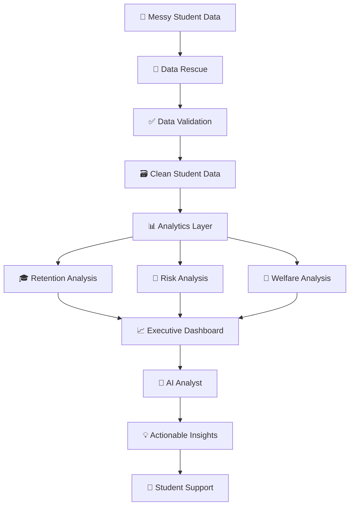
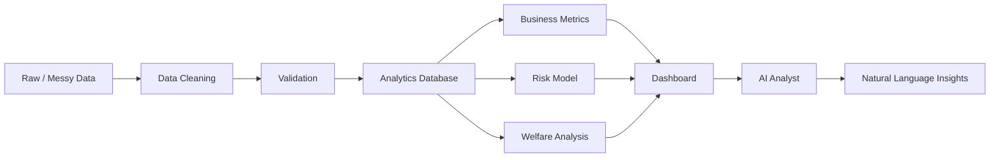
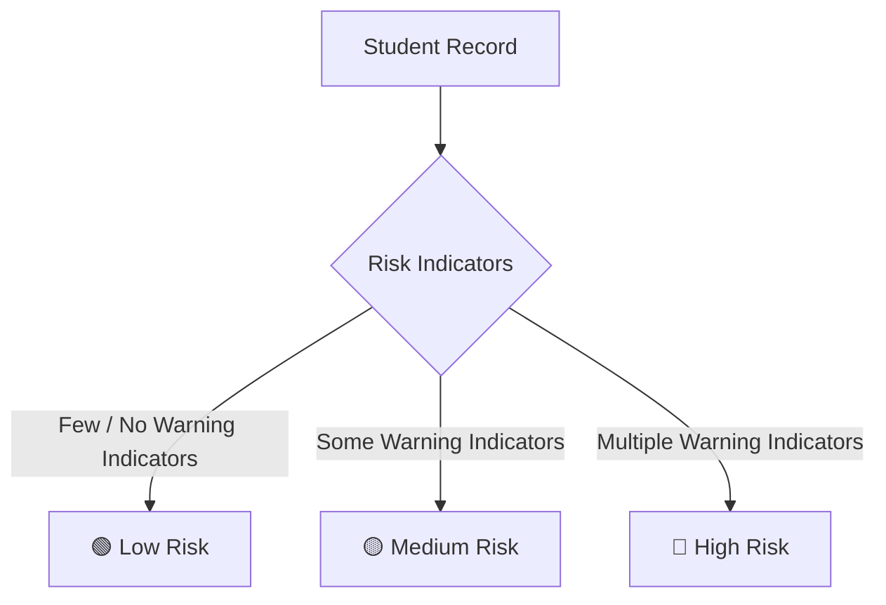
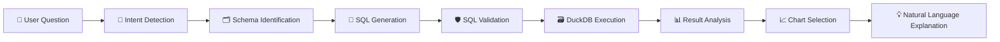
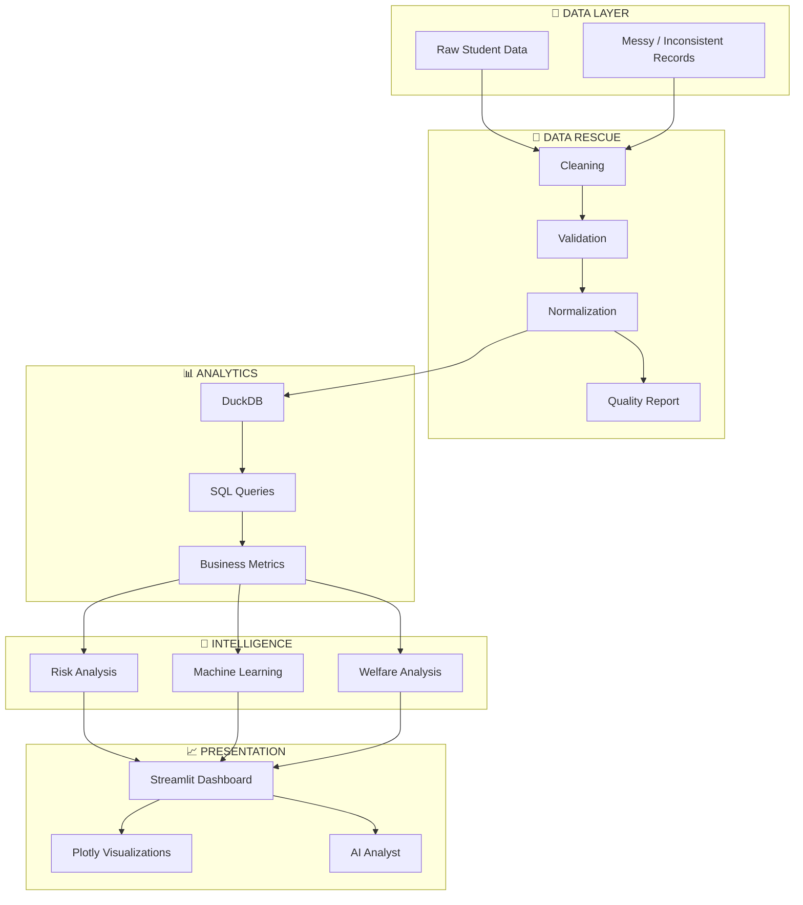

# 🎓 Student Retention & Welfare Efficacy Tracker

> ### From Messy Student Data to Actionable Retention & Welfare Insights

**Student Retention & Welfare Efficacy Tracker** is a data-driven Education & EdTech analytics platform designed to transform messy student data into reliable insights for **student retention, academic performance, risk identification, and welfare intervention analysis**.

The platform combines:

- 🧹 Data Rescue & Cleaning
- 📊 SQL-Based Analytics
- 🚨 Student Risk Analysis
- 🧠 Machine Learning
- 📈 Interactive Dashboard
- 🤖 Natural-Language AI Analyst
- 🔄 Reproducible Data Pipeline

The goal is simple:

> **Clean the data. Understand the risk. Measure the impact. Support students earlier.**

---

# 📌 Overview

Educational institutions collect large amounts of student information from different academic, attendance, engagement, and welfare-related sources.

However, real-world datasets are rarely clean.

Student records may contain:

- Duplicate records
- Missing values
- Inconsistent IDs
- Different department names
- Different attendance formats
- Incorrect data types
- Invalid values
- Inconsistent categories
- Broken relationships between records

These issues make it difficult for institutions to obtain reliable insights.

Our platform provides an end-to-end pipeline that transforms messy student data into a structured analytical system.



---

# 🎯 Problem Statement

## Student Retention & Welfare Efficacy Tracker

Educational institutions need to understand why students may become academically disengaged or require additional support.

But when information is spread across inconsistent datasets, answering important questions becomes difficult.

### Key Questions

- Which students may be at higher risk?
- Which departments have lower retention?
- Is attendance associated with academic performance?
- Which students require additional support?
- Are welfare interventions improving outcomes?
- Which intervention programs appear more effective?
- Where should institutional resources be prioritized?

The project aims to move from:

> **Reactive Student Support → Proactive Data-Driven Intelligence**

---

# 💡 Proposed Solution

The proposed platform follows an end-to-end data and analytics architecture.



The system separates the workflow into clear layers:

| Layer | Purpose |
|---|---|
| Data Rescue | Clean and standardize messy data |
| Validation | Detect invalid and suspicious records |
| Analytics | Generate meaningful business metrics |
| Risk Analysis | Identify students requiring attention |
| Welfare Analysis | Evaluate intervention outcomes |
| Dashboard | Present insights interactively |
| AI Analyst | Allow natural-language analytical queries |

---

# 🧹 Data Rescue & Data Quality

Data Rescue is one of the core components of the project.

The pipeline identifies and handles common problems found in messy enterprise-style datasets.

## Data Cleaning Operations

- 🔍 Duplicate detection
- 🆔 Student ID normalization
- 🧩 Relationship validation
- ❌ Missing-value detection
- ⚠️ Invalid-value detection
- 🔢 Data-type correction
- 🏫 Department normalization
- 📋 Category standardization
- 📊 Attendance normalization
- 📅 Date standardization
- 📈 Outlier detection
- 📋 Data-quality reporting

---

# 🧪 Example: Messy Student Data

### Before Cleaning

| Student ID | Department | Attendance | CGPA |
|---|---|---:|---:|
| 101 | CSE | 85% | 8.2 |
| 101 | cse | 85 | 8.20 |
| 102 | Computer Sci | 0.78 | 7.5 |

The same information can appear in different formats.

For example:

- `CSE`
- `cse`
- `Computer Sci`

And attendance may appear as:

- `85%`
- `85`
- `0.85`

---

## After Data Rescue

| Student ID | Department | Attendance | CGPA |
|---|---|---:|---:|
| 101 | CSE | 85% | 8.20 |
| 102 | CSE | 78% | 7.50 |

The pipeline creates a standardized representation.

```text
Raw Data
   ↓
Cleaned Data
   ↓
Validated Data
   ↓
Analytics Data
```

This improves:

- Reproducibility
- Data consistency
- Query reliability
- Analytics quality
- Dashboard accuracy

---

# 📊 Analytics Layer

The analytics layer converts cleaned student data into meaningful institutional metrics.

## Key Metrics

| Metric | Purpose |
|---|---|
| Total Students | Overall student population |
| Retained Students | Number of retained students |
| Retention Rate | Overall retention performance |
| At-Risk Students | Students showing risk indicators |
| Average CGPA | Academic performance overview |
| Average Attendance | Attendance overview |
| Academic Risk | Academic warning indicators |
| Attendance Risk | Attendance-related risk |
| Welfare Support | Support coverage |
| Intervention Success | Intervention outcome |
| Department Retention | Department comparison |
| Semester Retention | Trend analysis |
| Performance Distribution | Academic distribution |

---

# 🎓 Retention Analysis

The system can analyze retention patterns across different dimensions.

### Analysis Dimensions

- Departments
- Semesters
- Academic performance
- Attendance groups
- Risk categories
- Welfare interventions

Example analytical question:

> Which department has the lowest retention rate?

The analytics engine can calculate the result and present it using an appropriate visualization.

---

# 🚨 Student Risk Analysis

The platform provides analytical indicators for students who may require additional academic or welfare support.

## Potential Risk Indicators

- Low attendance
- Low CGPA
- Academic difficulties
- Backlogs
- Previous interventions
- Welfare-support requirements
- Engagement indicators
- Historical retention patterns

---

## Risk Categories



### 🟢 Low Risk

Stable academic and engagement indicators.

### 🟡 Medium Risk

One or more warning indicators are present.

### 🔴 High Risk

Multiple indicators suggest that closer attention may be appropriate.

> ⚠️ Risk scores are intended as **decision-support indicators** and should not be treated as automatic judgments about students.

---

# 🧠 Machine Learning

Machine-learning techniques can be used to identify patterns associated with student retention and academic risk.

## Possible Approaches

- Classification
- Risk scoring
- Student segmentation
- Feature analysis
- Retention prediction

The system is designed to evaluate models using actual validation results.

> **No artificial or hardcoded accuracy is used.**

Final model performance depends on:

- Dataset characteristics
- Available features
- Data quality
- Train/test split
- Model selection
- Feature engineering

---

# 🤖 AI Analyst

The AI Analyst provides a natural-language interface for interacting with the analytics system.

Instead of manually writing SQL queries, users can ask questions in normal language.

## Example Questions

```text
Show students with attendance below 60%.
```

```text
Compare retention rates across departments.
```

```text
Which department has the highest number of at-risk students?
```

```text
Show the relationship between attendance and CGPA.
```

```text
Which welfare intervention has the best outcome?
```

---

# 🔄 AI Agent Workflow



The AI Analyst operates on the structured analytics layer instead of directly modifying raw student data.

---

# 🛡️ AI Safety

The AI analytics layer is designed to operate as a read-only analytical assistant.

Allowed operations:

```sql
SELECT
```

Potentially destructive operations should be blocked:

```text
DROP
DELETE
UPDATE
INSERT
ALTER
TRUNCATE
CREATE
```

The AI Analyst should never be allowed to execute arbitrary system commands or unrestricted Python code.

---

# 📈 Executive Dashboard

The dashboard provides an interactive view of institutional student analytics.

## Dashboard Components

### Overview

- Total students
- Retention rate
- At-risk students
- Average CGPA
- Average attendance

### Academic Analytics

- CGPA distribution
- Attendance distribution
- Attendance vs CGPA
- Department performance
- Semester trends

### Retention Analytics

- Department-wise retention
- Semester-wise retention
- Risk distribution
- Retention trends

### Welfare Analytics

- Support coverage
- Intervention distribution
- Intervention outcomes
- Intervention effectiveness

### Student-Level Analytics

- Student records
- Risk indicators
- Academic indicators
- Attendance information

---

# 📊 Visualization Strategy

Different charts are used depending on the analytical question.

| Analytical Purpose | Visualization |
|---|---|
| Department comparison | 📊 Bar Chart |
| Retention trend | 📈 Line Chart |
| Risk distribution | 🍩 Donut Chart |
| CGPA distribution | 📊 Histogram |
| Attendance vs CGPA | 🔵 Scatter Plot |
| Student ranking | 📊 Horizontal Bar Chart |
| Important metric | 🔢 KPI Card |

The objective is to make complex data understandable at a glance.

---

# 🤝 Welfare Efficacy Analysis

The platform is designed not only to identify students who may require support, but also to examine whether interventions produce measurable outcomes.

## Possible Intervention Categories

- Academic counseling
- Attendance support
- Mentoring
- Welfare assistance
- Financial support
- Student engagement programs

Where the dataset supports it, the system can compare outcomes before and after intervention.

This changes the question from:

> **"How many students received support?"**

to:

> **"What impact did the support have?"**

---

# 💼 Business Insights

The platform converts analytical results into decision-support insights.

### Example Scenario

```text
Observation
    ↓
A department has a retention rate below
the institutional average.
    ↓
Supporting Indicators
    ↓
Lower average attendance
+
Higher academic-risk population
+
Higher intervention requirements
    ↓
Potential Action
    ↓
Prioritize mentoring, academic advising,
and welfare support for students
showing multiple risk indicators.
```

The purpose is not simply to display numbers.

The purpose is to help decision-makers understand:

**What happened? → Why might it matter? → Where should attention be focused?**

---

# 🌟 Key Features

- 🧹 Automated student-data cleaning
- 🔍 Duplicate detection
- 🆔 ID normalization
- ✅ Data validation
- 📋 Data-quality reporting
- 📊 Retention analytics
- 🎓 Academic performance analysis
- 🚨 Student risk analysis
- 🤝 Welfare intervention analysis
- 📈 Interactive dashboard
- 🔎 Department and semester filtering
- 🤖 Natural-language AI Analyst
- 🗃️ SQL-based analytics
- 🔄 Reproducible pipeline
- 🧪 Automated testing
- 📊 Dynamic visualizations

---

# 🏗️ System Architecture



---

# 📁 Project Structure

```text
Student-Retention-Welfare-Tracker-01/
│
├── README.md
├── LICENSE
├── requirements.txt
├── .gitignore
├── .env.example
│
├── data/
│   ├── raw/
│   ├── processed/
│   └── sample/
│
├── docs/
│   ├── architecture.md
│   ├── data_dictionary.md
│   ├── methodology.md
│   └── demo_questions.md
│
├── notebooks/
│   └── exploration.ipynb
│
├── src/
│   ├── config/
│   │   └── settings.py
│   │
│   ├── data/
│   │   ├── loader.py
│   │   ├── cleaner.py
│   │   ├── validator.py
│   │   ├── normalizer.py
│   │   └── quality_report.py
│   │
│   ├── analytics/
│   │   ├── database.py
│   │   ├── queries.py
│   │   ├── metrics.py
│   │   └── insights.py
│   │
│   ├── ml/
│   │   ├── features.py
│   │   ├── train.py
│   │   ├── predict.py
│   │   └── model.py
│   │
│   ├── agent/
│   │   ├── agent.py
│   │   ├── intent.py
│   │   ├── query_generator.py
│   │   ├── query_validator.py
│   │   ├── chart_selector.py
│   │   └── prompts.py
│   │
│   └── utils/
│       ├── logging.py
│       └── helpers.py
│
├── app/
│   ├── streamlit_app.py
│   │
│   ├── components/
│   │   ├── sidebar.py
│   │   ├── kpi_cards.py
│   │   ├── charts.py
│   │   ├── tables.py
│   │   └── agent_chat.py
│   │
│   └── pages/
│       ├── 01_Executive_Dashboard.py
│       ├── 02_Data_Quality.py
│       ├── 03_Student_Analytics.py
│       ├── 04_Risk_Analysis.py
│       └── 05_AI_Analyst.py
│
├── api/
│   ├── main.py
│   └── routes/
│       ├── students.py
│       ├── analytics.py
│       └── agent.py
│
├── tests/
│   ├── test_cleaner.py
│   ├── test_validator.py
│   ├── test_metrics.py
│   ├── test_queries.py
│   └── test_agent.py
│
└── scripts/
    ├── generate_messy_data.py
    ├── clean_data.py
    ├── build_database.py
    └── train_model.py
```

---

# 🛠️ Technology Stack

## Data Engineering

- Python
- Pandas
- SQL
- DuckDB

## Analytics

- Python
- SQL
- Plotly

## Machine Learning

- Scikit-learn

## Dashboard

- Streamlit
- Plotly

## AI Analyst

- Open-source / Local LLM
- Natural Language Processing
- SQL Generation
- Rule-based fallback

## Development

- Git
- GitHub
- Python Virtual Environment
- Automated Testing

---

# 🔁 Reproducible Pipeline

The project is designed so that the complete data workflow can be reproduced.

## Step 1 — Prepare Data

```bash
python scripts/generate_messy_data.py
```

## Step 2 — Clean Data

```bash
python scripts/clean_data.py
```

## Step 3 — Build Analytics Database

```bash
python scripts/build_database.py
```

## Step 4 — Train Model

```bash
python scripts/train_model.py
```

## Step 5 — Start Dashboard

```bash
streamlit run app/streamlit_app.py
```

---

# ⚙️ Installation

## Clone the Repository

```bash
git clone https://github.com/YOUR-USERNAME/Student-Retention-Welfare-Tracker-01.git
```

```bash
cd Student-Retention-Welfare-Tracker-01
```

## Create Virtual Environment

### Windows

```bash
python -m venv .venv
```

```bash
.venv\Scripts\activate
```

### Linux / macOS

```bash
python3 -m venv .venv
```

```bash
source .venv/bin/activate
```

## Install Dependencies

```bash
pip install -r requirements.txt
```

## Run the Application

```bash
streamlit run app/streamlit_app.py
```

---

# 📋 Data Dictionary

The final data dictionary should reflect the actual fields provided in the organizer dataset.

Typical fields may include:

| Field | Description |
|---|---|
| Student ID | Unique student identifier |
| Name | Student name |
| Department | Academic department |
| Semester | Current academic semester |
| Attendance | Attendance percentage |
| CGPA | Academic performance indicator |
| Backlogs | Number of academic backlogs |
| Retention Status | Student retention outcome |
| Welfare Support | Welfare support indicator |
| Intervention | Intervention information |
| Risk Level | Analytical risk category |

---

# 🧪 Testing

Testing is included for important parts of the data and analytics pipeline.

### Test Areas

- Data cleaning
- Data validation
- Duplicate detection
- Metric calculations
- SQL queries
- Risk analysis
- AI-agent behavior

Run tests with:

```bash
pytest
```

---

# 🔐 Responsible Data Usage

Student information may contain sensitive or personally identifiable data.

The project therefore follows responsible-data principles.

### Principles

- Use anonymized or synthetic data where appropriate
- Avoid unnecessary personally identifiable information
- Protect sensitive student information
- Restrict access to authorized users
- Avoid unfair automated decisions
- Treat risk predictions as decision-support indicators
- Keep humans involved in important student-support decisions

> The system is designed to **support academic and welfare professionals, not replace them**.

---

# 🌍 Impact & Scalability

The platform can potentially support:

- Universities
- Colleges
- Educational institutions
- Academic administrators
- Faculty advisors
- Student welfare departments
- Institutional planning teams

## Potential Benefits

- Earlier identification of students requiring support
- Better allocation of welfare resources
- Data-driven intervention planning
- Improved visibility into retention patterns
- Measurement of intervention effectiveness
- Faster access to institutional analytics

The architecture can be extended to larger datasets and additional institutions.

---

# 🔮 Future Scope

Future improvements could include:

- Real-time student-risk monitoring
- Automated intervention recommendations
- Explainable AI for predictions
- Personalized student-support recommendations
- Early-warning notifications
- Learning Management System integration
- Student engagement analytics
- Scholarship and financial-aid analysis
- Placement and internship analytics
- Longitudinal student journey analysis
- Advanced AI-powered institutional analytics

---

# 🎯 Project Goal

The goal of the Student Retention & Welfare Efficacy Tracker is to transform messy educational data into actionable intelligence.

The platform aims to help institutions:

```text
Collect
  ↓
Clean
  ↓
Understand
  ↓
Identify Risk
  ↓
Evaluate Interventions
  ↓
Take Action
```

The larger vision is:

> ### Reactive Support → Proactive Intelligence

---

# 🏆 Hackathon

### Track

**Education & EdTech**

### Problem Statement

**Student Retention & Welfare Efficacy Tracker**

### Event

**TransOrg AgentIQ Datathon — From Messy Data to Agentic Insights**

---

# 👥 Team

| Role | Responsibility |
|---|---|
| 👨‍💻 Data Engineer | Data cleaning, validation & pipeline |
| 📊 Data Analyst | SQL, metrics & business insights |
| 🎨 Dashboard Developer | Streamlit, Plotly & UI/UX |
| 🤖 AI/ML Developer | Risk model & AI Analyst |

---

# 📌 Important Notes

The project is designed around the organizer-provided dataset.

The final:

- Data fields
- Model performance
- Risk metrics
- Retention metrics
- Intervention metrics
- Dashboard results

should be based on the actual dataset and implementation.

No fabricated analytical results or model-performance claims should be presented.

---

# 📄 License

This project is licensed under the **MIT License**.

See the [`LICENSE`](LICENSE) file for details.

---

# ⭐ Project Vision

### From Messy Student Data to Proactive Student Support

**Clean the data.  
Understand the risk.  
Measure the impact.  
Support students earlier.**

---
