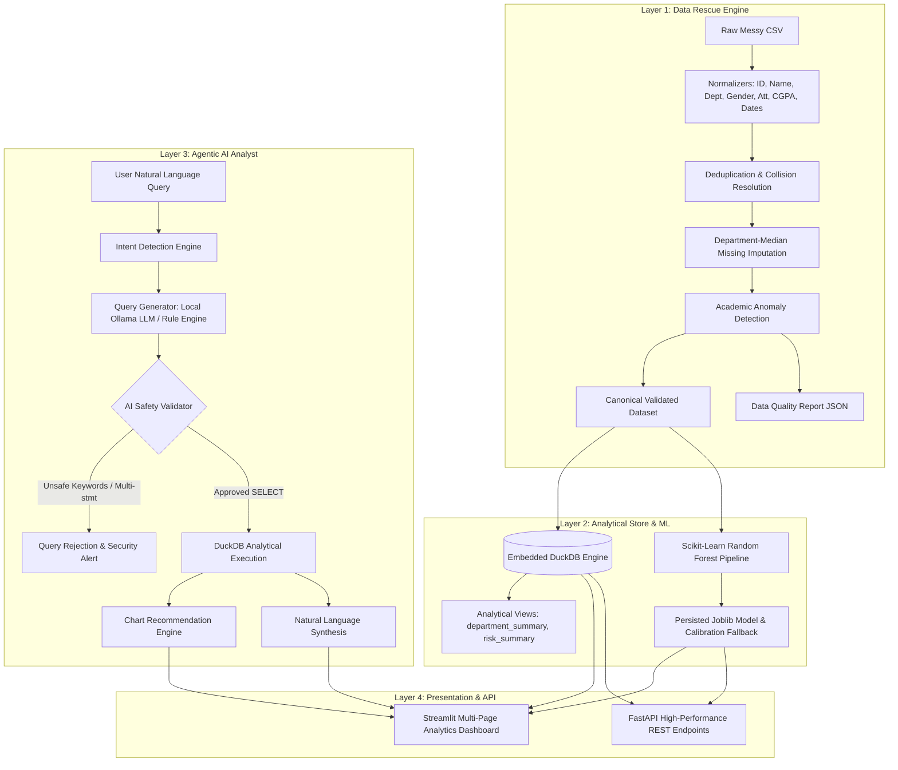

# StudentIQ Architectural Blueprint

StudentIQ is architected around a multi-stage **Data Rescue to Agentic Insights** pipeline designed for academic retention and welfare intelligence.

## System Architecture

## Layer Descriptions

1. **Data Rescue Engine**: Converts malformed, inconsistent student data into canonical records with verifiable data quality scores.
2. **DuckDB Analytics**: Columnar OLAP database providing fast aggregations across cohorts, departments, and grade bands.
3. **ML Risk Model**: Scikit-learn classification pipeline assessing retention vulnerability into 4 calibrated tiers (LOW, MEDIUM, HIGH, CRITICAL).
4. **Agentic Copilot**: Natural language query interface with strict AST/regex query sanitization preventing SQL injection or state mutation.
5. **Presentation**: Polished Streamlit UI with dark glassmorphic styling and FastAPI backend endpoints.